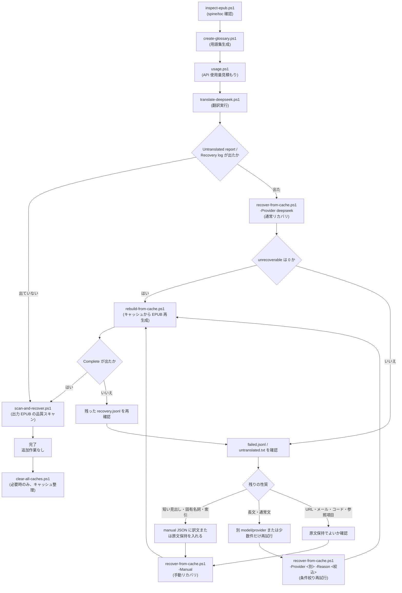

# epubicus

`epubicus` は、多言語の EPUB を日本語 EPUB に翻訳する CLI ツールです。EPUB のパッケージ構造と XHTML の体裁をできるだけ保ったまま翻訳します。

翻訳 provider は Ollama、OpenAI API、Claude API、DeepSeek API に対応しています。

## ドキュメント

- [docs/README.md](docs/README.md): 運用ガイド、復旧手順、設計メモの索引。
- [docs/scripts-reference.ja.md](docs/scripts-reference.ja.md): `scripts/` 各スクリプトの目的・引数・使用例リファレンス。
- [docs/translation-workflow.ja.md](docs/translation-workflow.ja.md): glossary 作成から方式別の翻訳・リカバリーまでの手順書。
- [docs/operation-guide.ja.md](docs/operation-guide.ja.md): 日本語の運用ガイド。
- [docs/detailed-examples.ja.md](docs/detailed-examples.ja.md): 詳細な実行例と cache 操作。
- [docs/runtime-progress.ja.md](docs/runtime-progress.ja.md): リリースビルド実行、ETA 計測、インラインマーカー検証の運用メモ。
- [docs/batch-recovery.ja.md](docs/batch-recovery.ja.md): OpenAI Batch API 実行後の復旧手順。
- [CHANGELOG.md](CHANGELOG.md): バージョンごとの変更履歴。

## クイックスタート

まず EPUB の構造と目次を確認します。spine 番号は EPUB 内部で定義されている本文ファイルの読む順番です。翻訳コマンドの `FROM` / `TO` は EPUB リーダー上のページ番号ではなく、`inspect-epub.ps1` で表示される 1 始まりの spine 番号です。

```powershell
.\scripts\inspect-epub.ps1 .\book.epub
```

`inspect-epub.ps1` の出力例:

この出力は、後続の `usage.ps1` や `translate-deepseek.ps1 -From -To` に渡す開始番号・終了番号を選ぶために見ます。`toc` の章タイトルと `inspect` の `Href` を見比べて、本文らしい番号を選んでください。たとえば次のように、目次で第 1 章が `c66.xhtml` を指していて、`inspect` の一覧で `c66.xhtml` が `No 9` なら、確認範囲には `9 9` を使います。

```text
[inspect]
  No  Linear  Exists   Bytes  Blocks  Media Type              Href
-------------------------------------------------------------------
   7  yes     yes       4658       8  application/xhtml+xml   c56.xhtml
   8  yes     yes       3249       8  application/xhtml+xml   c5P.xhtml
   9  yes     yes       4246       8  application/xhtml+xml   c66.xhtml

[toc]
- Preface -> c56.xhtml
- Why You Should Not Stop Reading Here -> c5P.xhtml
- 1 Writing Is a Trade -> c66.xhtml
```

用語集候補を作ります。既に `book.json` がある場合はそのまま使われます。

```powershell
.\scripts\create-glossary.ps1 .\book.epub
```

DeepSeek API キーを設定します。

```powershell
$env:DEEPSEEK_API_KEY = Read-Host "DeepSeek API key" -MaskInput
```

次に、使用量と本文ファイル 1 個だけの試し翻訳を確認します。使用量確認では、対象範囲のリクエスト数と input / output token の概算を見ます。試し翻訳では、全体翻訳の前に選んだ本文ファイルだけを翻訳し、本文が日本語化されること、見出し・リンク・強調などの XHTML 構造が崩れないこと、用語集の訳語が反映されることを見ます。

確認範囲は省略できません。`inspect-epub.ps1` の一覧を見て、本文らしい番号を選んでください。次の例の `9 9` は開始番号と終了番号がどちらも `9` なので、9 番目の本文ファイルだけを対象にします。実際の EPUB に合わせて変更してください。

使用量を確認します。このコマンドは provider を呼び出しません。

```powershell
.\scripts\usage.ps1 .\book.epub 9 9 -Provider deepseek
```

`usage.ps1` の出力例:

選んだ範囲を翻訳すると何リクエスト・何 token くらい使いそうかを見積もります。未キャッシュの範囲では概算 token が表示されます。すでに全ブロックがキャッシュ済みの場合、未キャッシュ分の概算は `0` になります。

```text
Usage estimate only. No translation provider was called.
Provider: deepseek
Model: deepseek-v4-flash
Pages: 1/50 selected
Blocks: 8 total, 0 cached, 8 uncached
Source chars: 3594 total, 3594 uncached
Estimated API requests: 8
Estimated tokens: input 2035, output 902, total 2937
Note: token counts are approximate before the API returns actual usage.
```

読み方:

```text
Blocks: 8 total, 0 cached, 8 uncached
```

選んだ範囲に翻訳対象ブロックが 8 個あり、そのうち 8 個が未キャッシュです。未キャッシュ分だけ API に送ります。

```text
Estimated API requests: 8
Estimated tokens: input 2035, output 902, total 2937
```

この範囲を初めて翻訳すると、概算で 8 リクエスト、合計 2937 token ほど使う見込みです。token 数は provider に送る前の概算なので、実際の API usage とは少しずれることがあります。

本文ファイル 1 個だけを試し翻訳します。このコマンドは実際に provider を呼び出し、`.\book_jp.epub` を書きます。`-From` と `-To` で範囲を指定します。

```powershell
.\scripts\translate-deepseek.ps1 .\book.epub -From 9 -To 9
```

試し翻訳の出力例:

選んだ本文ファイルだけを翻訳した結果です。

```text
Done.
Output: .\book_jp.epub
Translation:
  provider: deepseek
  model: deepseek-v4-flash
  pages translated: 1
  blocks translated: 8
Cache:
  hits: 0
  misses: 8
  writes: 8
```

読み方:

```text
pages translated: 1
blocks translated: 8
```

選んだ本文ファイル 1 個の中で、8 ブロックを翻訳しました。

```text
hits: 0
misses: 8
writes: 8
```

既存キャッシュは 0 件、API に送った未キャッシュブロックは 8 件、成功してキャッシュへ書いた訳文は 8 件です。再実行時に `hits` が増え、`misses` と `writes` が減れば、キャッシュ再利用が効いています。

使用量見積もり・試し翻訳の引数形式です。`usage.ps1` は開始番号と終了番号が必須、`translate-deepseek.ps1` は `-From` / `-To` を省略すると全体翻訳になります。

```text
usage.ps1                <入力EPUB> <開始番号> <終了番号> -Provider deepseek
translate-deepseek.ps1   <入力EPUB> [-From <開始番号> -To <終了番号>]
```

全体を翻訳します。`-From` / `-To` を付けなければ全 spine を対象とします。出力は入力 EPUB と同じフォルダの `<入力名>_jp.epub` です。

```powershell
.\scripts\translate-deepseek.ps1 .\book.epub
```

変換後の出力例:

```text
Done.
Output: D:\books\book_jp.epub
Translation:
  provider: deepseek
  model: deepseek-v4-flash
  pages translated: 50
  blocks translated: 1095
Cache:
  hits: 1090
  misses: 3
  writes: 8
  location: D:\books\.cache\0123456789abcdef0123456789abcdef
Untranslated report: 3 block(s) written to D:\books\.cache\0123456789abcdef0123456789abcdef\recovery\book_jp\untranslated.txt
Recovery log: D:\books\.cache\0123456789abcdef0123456789abcdef\recovery\book_jp\recovery.jsonl
Resume:
  recover the untranslated blocks, then rebuild from the cache.
  recover: cargo run --release -- recover ...
Time:
  elapsed: 00:42:10
  total active: 00:42:10
API usage: requests: 1200, input tokens: 180000, output tokens: 110000, total tokens: 290000
```

読み方:

```text
pages translated: 50
blocks translated: 1095
```

EPUB 内の本文ファイル 50 個を処理し、その中の 1095 ブロックに訳文を入れています。

```text
hits: 1090
misses: 3
writes: 8
```

`hits` は既存キャッシュを使えた数、`misses` はキャッシュに訳文がなく原文のまま残った数、`writes` は今回新しくキャッシュへ書いた訳文の数です。中断後や再実行後に `hits` が増えていれば、再開できています。

```text
Untranslated report: 3 block(s) written to ...
Recovery log: ...
```

未翻訳が残っています。`untranslated.txt` は人間が読む確認用、`recovery.jsonl` は復旧コマンドが使うログです。`misses` や未翻訳数が 0 なら、通常は追加作業は不要です。

処理の流れ:



各ノードのスクリプトと役割:

| 段階 | スクリプト | 役割 |
|---|---|---|
| 前処理 1 | `inspect-epub.ps1` | EPUB の spine / 目次を表示し、`-From` / `-To` に渡す番号を選ぶ |
| 前処理 2 | `create-glossary.ps1` | 用語集候補（`book.json` / `book.md`）を生成 |
| 見積もり | `usage.ps1 -Provider <P>` | 指定範囲の API リクエスト数 / token を試算（API 未呼出） |
| 翻訳 | `translate-<provider>.ps1` | 全体翻訳 / 範囲翻訳。`-PartialFromCache` でキャッシュからの再生成も可 |
| 通常リカバリ | `recover-from-cache.ps1 -Provider <P>` | `recovery.jsonl` の未翻訳ブロックを再翻訳 |
| 手動リカバリ | `recover-from-cache.ps1 -Provider <P> -Manual <json>` | 手動訳 JSON をキャッシュ直書き（API 未呼出） |
| Batch リカバリ | `batch-recover-local.ps1` | OpenAI Batch API 専用の複合救済ワークフロー |
| 品質スキャン | `scan-and-recover.ps1 -Provider <P>` | 完成 EPUB を再走査し、validator を通った怪しいブロックを検出 |
| 再構築 | `rebuild-from-cache.ps1` | API を呼ばず EPUB を再生成（provider/model はキャッシュから自動検出） |
| キャッシュクリア | `clear-all-caches.ps1` | 全キャッシュ削除 |

1. 変換後の出力に `Untranslated report:` または `Recovery log:` があるか確認します。
2. 残っている場合は、同じ入力 EPUB に対して復旧スクリプトを実行します。

```powershell
.\scripts\recover-from-cache.ps1 .\book.epub -Provider deepseek
```

復旧後の出力例:

```text
Recovery completed
input: D:\books\book.epub
cache: D:\books\.cache\0123456789abcdef0123456789abcdef
items: 3
cache updated: 3
unrecoverable: 0
Rebuilding EPUB from recovered cache...
Done.
Output: D:\books\book_jp.epub
Complete:
  no cache misses or untranslated blocks remain.
```

3. `cache updated` は、復旧でキャッシュへ書き込めた件数です。
4. `unrecoverable` が 0 なら、復旧不能な item はありません。
5. `Complete:` と `no cache misses or untranslated blocks remain.` が表示されれば、未翻訳は残っていません。
6. 復旧後に再度 `Untranslated report:` が出た場合は、もう一度同じ復旧スクリプトを実行します。キャッシュ済みブロックは再利用されます。
7. 同じブロックが何度も残る場合は、[詳細な実行例](docs/detailed-examples.ja.md) と [運用ガイド](docs/operation-guide.ja.md) の手動訳リカバリーを参照してください。

## スクリプト

日常的な実行では、長い `cargo run --release -- ...` を直接組み立てる代わりに `scripts\*.ps1` を使います。スクリプトは入力 EPUB と同じ場所の glossary、自動出力名、provider ごとの cache root を揃えます。

| 種類 | スクリプト | 引数 | 説明 |
|--|--|--|--|
| 事前確認 | `inspect-epub.ps1` | `<入力EPUB>` | EPUB の本文ファイル順序と目次を表示します。`usage.ps1` や `translate-deepseek.ps1 -From -To` に渡す開始番号・終了番号を選ぶために使います。 |
| 用語集 | `create-glossary.ps1` | `<入力EPUB>` | 入力 EPUB の隣に glossary 候補 JSON を作ります。既に同名 JSON がある場合はそれを使います。詳細指定では `-MinOccurrences`、`-MaxEntries`、`-Force` も使えます。 |
| 使用量確認 | `usage.ps1` | `<入力EPUB> <開始番号> <終了番号> -Provider <name>` | 指定した本文ファイル範囲について、provider に送る前にリクエスト数と概算 token 数を表示します。provider は呼びません。開始番号・終了番号は必須です。 |
| 翻訳 | `translate-deepseek.ps1` | `<入力EPUB> [-From <開始番号> -To <終了番号>]` | DeepSeek で翻訳し `<入力名>_jp.epub` を作ります。`-From` / `-To` で範囲指定、省略で全体翻訳。中断後は同じコマンドで再開できます。`-PartialFromCache` でキャッシュから再構築のみも可能です。OpenAI / Claude / Ollama 用には `translate-openai.ps1`、`translate-claude.ps1`、`translate-ollama.ps1`、`translate-openai-batch.ps1` を使います。 |
| キャッシュ再生成 | `rebuild-from-cache.ps1` | `<入力EPUB> [auto\|fixed\|reflow]` | 既存キャッシュから EPUB を再生成します。第 2 引数は固定レイアウトの扱いで、省略時は `auto` です。 |
| 復旧 | `recover-from-cache.ps1` | `<入力EPUB> -Provider <name> [options]` | 最新の復旧ログから未翻訳ブロックだけを再翻訳し、成功した訳文をキャッシュへ戻して EPUB を再生成します。`-Model` で model、`-Reason`、`-Limit` などで対象を絞れます。`-Manual <JSON>` で手動訳 JSON を直接キャッシュへ書き込みます。 |
| 検査と復旧 | `scan-and-recover.ps1` | `<入力EPUB> -Provider <name> [-ScanOnly]` | 既に作成した `<入力名>_jp.epub` を検査し、未翻訳候補があれば復旧して再生成します。`-ScanOnly` で検査のみ行います。 |
| 整理 | `clear-all-caches.ps1` | `[-DryRun] [-Yes]` | ローカルの翻訳キャッシュをまとめて削除します。`-DryRun` で対象確認、`-Yes` で確認なしに削除します。 |

`translate-deepseek.ps1` には、`translate` の追加オプションをそのまま渡せます。小説向けに翻訳する場合は文体を `novel` にします。

```powershell
.\scripts\translate-deepseek.ps1 .\book.epub --style novel
```

丁寧寄りの小説文体にする場合:

```powershell
.\scripts\translate-deepseek.ps1 .\book.epub --style novel-polite
```

## コマンド

```powershell
cargo run -- translate <INPUT.epub> [-o OUTPUT.epub] [OPTIONS]
cargo run -- test      <INPUT.epub> --from N --to M [OPTIONS]
cargo run -- inspect   <INPUT.epub>
cargo run -- toc       <INPUT.epub>
cargo run -- glossary  <INPUT.epub> [-o glossary.json]
cargo run -- batch     <SUBCOMMAND>
cargo run -- cache     <SUBCOMMAND>
```

`translate` は EPUB を作成します。本番翻訳では、経過時間、予想残り時間、選択した spine ページ、翻訳対象 XHTML ブロック数、未キャッシュブロックの provider リクエスト進捗をプログレスバーに表示します。ETA は現在の実行、または再開した時点から測りますが、spine 1〜3ページ目はETAの計測時間と文字数から除外します。開始時に4ページ目以降の未キャッシュ原文文字数を数え、4ページ目以降のprovider作業の計測時間が5分に達するまでは `ETA pending` のままにし、その後は4ページ目以降で完了した未キャッシュ文字数と経過時間の累積平均から、残りの未キャッシュ文字数を単純に予測します。以前の実行でキャッシュ済みだった分は進捗位置には反映しますが、ETA の分母には入れません。OpenAI / Claude など provider が usage を返す場合は、終了時に API リクエスト数と input / output / total tokens を表示します。

`test` は指定した本文ファイル範囲の翻訳結果を標準出力に表示します。EPUB は作成しません。

`inspect` は OPF のパス、spine 順、`linear` 状態、参照先ファイルの有無、ファイルサイズ、翻訳対象 XHTML ブロック数の概算を表示します。

`toc` は EPUB3 `nav.xhtml` または EPUB2 NCX の目次を、階層インデントとリンク先付きで表示します。

`glossary` は固有名詞や専門用語の候補を JSON に出力します。

`batch` は OpenAI Batch API 用の非同期翻訳ワークフローを管理します。`batch run` は準備、送信、状態確認、取得、取り込み、検証をまとめて実行します。途中で待機をやめた場合やリモート側で失敗・未完了が残った場合は、まず `batch reroute-local` で対象を `local_pending` にマークし、次に `batch translate-local` でその `local_pending` を Ollama などの通常 provider で翻訳します。`reroute-local` は対象選択だけを行い、翻訳はしません。

未完了分をローカルに回す例:

```powershell
cargo run -- batch health .\book.epub
cargo run -- batch reroute-local .\book.epub --remaining --priority short-first
cargo run -- batch translate-local .\book.epub --provider ollama --model qwen3:14b --limit 100
cargo run -- batch verify .\book.epub
cargo run --release -- translate .\book.epub --partial-from-cache --keep-cache -o .\book_jp.epub
```

## オプション一覧

### `translate`

| オプション | デフォルト | 説明 |
|--|--|--|
| `-o, --output PATH` | `<input>.ja.epub` | 出力 EPUB |
| `--from N` | 先頭 | 翻訳する最初の本文ファイル番号。`inspect-epub.ps1` で表示される spine 番号 |
| `--to N` | 末尾 | 翻訳する最後の本文ファイル番号。`inspect-epub.ps1` で表示される spine 番号 |
| `--partial-from-cache` | false | キャッシュ済みブロックだけ訳文に差し替え、ミスは原文維持。未翻訳が残った場合、EPUB と未翻訳レポートを書いた後にエラー終了 |

未翻訳が残った状態で EPUB と復旧ログを書けた場合、`recover` で復旧不能 item が `failed.jsonl` に残った場合、`scan-recovery` が未翻訳候補を検出して復旧ログを書いた場合は、継続可能エラーとして終了コード `2` を返します。入力 EPUB が壊れている、出力先に書けないなど処理を継続できない失敗は通常のエラーとして終了コード `1` です。

### `test`

| オプション | デフォルト | 説明 |
|--|--|--|
| `--from N` | 必須 | 標準出力に出す最初の本文ファイル番号。`inspect-epub.ps1` で表示される spine 番号 |
| `--to N` | 必須 | 標準出力に出す最後の本文ファイル番号。`inspect-epub.ps1` で表示される spine 番号 |

### `translate` / `test` 共通

CLI 引数を指定した場合は、環境変数より CLI 引数が優先されます。

| オプション | 環境変数 | デフォルト | 説明 |
|--|--|--|--|
| `-p, --provider ollama\|openai\|claude\|deepseek` | `EPUBICUS_PROVIDER` | `ollama` | 翻訳 provider |
| `-m, --model NAME` | `EPUBICUS_MODEL` | provider ごと | モデル名 |
| `--fallback-provider ollama\|openai\|claude\|deepseek` | `EPUBICUS_FALLBACK_PROVIDER` | なし | 主 provider が拒否・説明文らしい応答を返し、リトライが尽きた場合だけ使う fallback provider |
| `--fallback-model NAME` | `EPUBICUS_FALLBACK_MODEL` | fallback provider ごと | fallback provider のモデル名 |
| `--ollama-host URL` | `EPUBICUS_OLLAMA_HOST` | `http://localhost:11434` | Ollama エンドポイント |
| `--openai-base-url URL` | `EPUBICUS_OPENAI_BASE_URL` | `https://api.openai.com/v1` | OpenAI API base URL |
| `--claude-base-url URL` | `EPUBICUS_CLAUDE_BASE_URL` | `https://api.anthropic.com/v1` | Claude / Anthropic API base URL |
| `--openai-api-key KEY` | `OPENAI_API_KEY` | なし | OpenAI API キー。`--openai-api-key` が優先 |
| `--anthropic-api-key KEY` | `ANTHROPIC_API_KEY` | なし | Anthropic API キー。`--anthropic-api-key` が優先 |
| なし | `DEEPSEEK_API_KEY` | なし | DeepSeek API キー。`--prompt-api-key` でも入力可能 |
| `--prompt-api-key` | なし | false | 実行時に API キーを非表示入力 |
| `-T, --temperature F` | `EPUBICUS_TEMPERATURE` | `0.3` | サンプリング温度 |
| `-n, --num-ctx N` | `EPUBICUS_NUM_CTX` | `8192` | Ollama に渡すコンテキスト長 |
| `-t, --timeout-secs N` | `EPUBICUS_TIMEOUT_SECS` | `900` | 1 リクエストあたりの HTTP タイムアウト秒数 |
| `-r, --retries N` | `EPUBICUS_RETRIES` | `3` | 初回リクエスト後の通信リトライ回数。タイムアウト、接続失敗、rate limit、server error に使う |
| `--validation-retries N` | `EPUBICUS_VALIDATION_RETRIES` | `1` | provider の返答が翻訳検証に失敗した場合のリトライ回数。原文そのまま、英語残り、inline placeholder 破損などに使う |
| `-x, --max-chars-per-request N` | `EPUBICUS_MAX_CHARS_PER_REQUEST` | `3500` | これより長い XHTML テキストブロックを文境界で複数リクエストに分割。`0` で分割を無効化 |
| `-j, --concurrency N` | `EPUBICUS_CONCURRENCY` | `1` | XHTML ファイル単位で、未キャッシュの provider リクエストを最大 N 件並列実行。rate limit、timeout、server error などの再試行対象エラーが出た場合は実効並列数を自動的に下げ、成功リクエストが続いたら指定上限まで少しずつ戻す |
| `-s, --style STYLE` | `EPUBICUS_STYLE` | `essay` | 文体プリセット。`novel`, `novel-polite`, `tech`, `essay`, `academic`, `business` |
| `-d, --dry-run` | なし | false | provider を呼ばず、原文を使って EPUB 処理だけ確認 |
| `-g, --glossary PATH` | なし | なし | 用語統一に使う glossary JSON |
| `--cache-root PATH` | なし | OS 標準（`%LOCALAPPDATA%\epubicus\cache` / `~/.cache/epubicus`） | キャッシュ root を上書き。入力 EPUB ごとに `<cache-root>/<input-hash>/` 以下に保存 |
| `--no-cache` | なし | false | キャッシュを読み書きしない。既存キャッシュは削除しない |
| `--clear-cache` | なし | false | この入力 EPUB のキャッシュを削除してから翻訳開始 |
| `-k, --keep-cache` | なし | false | 成功完了後もキャッシュを保持（デフォルトは自動削除） |
| `-u, --usage-only` | なし | false | provider を呼ばず、対象ページのAPIリクエスト数と概算トークン数だけを表示 |
| `--passthrough-on-validation-failure` | `EPUBICUS_PASSTHROUGH_ON_VALIDATION_FAILURE` | false | 検証リトライ後も失敗するブロックを原文のまま出力して処理を継続。キャッシュには保存しないため後で再試行可能。リンクやインライン構造を壊したくない目次・索引項目の救済用 |
| `--verbose` | `EPUBICUS_VERBOSE` | false | 処理中の詳細 warning（リトライ、並列数調整、fallback、長文分割など）を表示 |

### `recover`

| オプション | デフォルト | 説明 |
|--|--|--|
| `LOG` | `--cache` 未指定時は必須 | `translate` が `Recovery log:` として表示した `recovery.jsonl` |
| `--cache TARGET` | なし | 入力 EPUB パスまたは cache hash prefix から最新の `recovery.jsonl` を自動選択 |
| `--input PATH` | recovery log の `input_epub` | 入力 EPUB を明示 |
| `--limit N` | 全件 | 復旧する最大件数 |
| `--list` | false | 条件に一致する復旧ログ item を表示するだけで、翻訳は行わない |
| `--page N` | 全ページ | 指定した本文ファイル番号の item だけを対象にする |
| `--block N` | 全 block | 指定 block index の item だけを対象にする |
| `--reason REASON` | 全理由 | 指定理由の item だけを対象にする。複数回指定可 |
| `--failed-log PATH` | `<LOG のディレクトリ>\failed.jsonl` | 復旧不能 item の出力先 |
| `--manual PATH` | なし | 手動訳 JSON を読み込み、一致した item を provider に送らず直接キャッシュへ書き込む |
| `--rebuild` | false | 選択 item がすべて復旧できた場合、キャッシュから EPUB を再生成 |
| `--output PATH` | recovery log の `output_epub` | `--rebuild` で再生成する EPUB の出力先 |

`recover` では、同じ検証失敗を長く繰り返さないため、`--validation-retries` / `EPUBICUS_VALIDATION_RETRIES` の既定値を 1 回にしています。通信失敗、rate limit、server error は `--retries` / `-r` / `EPUBICUS_RETRIES` の対象です。

`--reason` / PowerShell スクリプトの `-Reason` で指定できる主な値:

| reason | 意味 | 主な対応 |
|--|--|--|
| `cache_miss` | キャッシュに訳文がなく、原文のまま部分出力された | 通常の復旧対象。provider/model を指定して翻訳 |
| `invalid_cached_translation` | キャッシュに訳文はあるが、現在の検証で不正と判定された | 同じ model で繰り返さず、別 model/provider、または手動訳を検討 |
| `validation_passthrough` | provider を呼んだが検証失敗後に原文保持された | 別 model/provider、または手動訳を検討 |
| `inline_restore_failed` | 訳文から XHTML インライン要素を復元できなかった | inline placeholder 対策付きで再翻訳、または手動確認 |
| `detected_untranslated_output` | 出力済み EPUB の検査で未翻訳らしい block と判定された | `scan-recovery` 後の再翻訳対象 |
| `unchanged_source` | provider が原文をそのまま返した | 見出し・短文なら別 model/provider、翻訳不要なら手動で原文保持判断 |
| `original_output` | 出力 EPUB に原文が残っていることを検出した | 必要なら再翻訳、意図的な原文保持なら手動で扱う |

例:

```powershell
cargo run -- recover $log --list
cargo run -- recover $log --page 12 --block 3
cargo run -- recover $log --reason cache_miss --limit 20
cargo run -- recover $log `
  --manual .\book.manual.json `
  --rebuild
cargo run -- recover $log --rebuild
cargo run -- recover --cache .\book.epub --rebuild
```

### `scan-recovery`

完成済み、または部分出力済みの EPUB を元 EPUB と突き合わせ、未翻訳らしい block から `recovery.jsonl` を作ります。出力先は通常の復旧ログと同じく、入力 EPUB のキャッシュ配下の `recovery\<出力EPUB名>\` です。

| オプション | デフォルト | 説明 |
|--|--|--|
| `INPUT` | 必須 | 元の入力 EPUB |
| `OUTPUT` | 必須 | 検査する翻訳済み、または部分翻訳済み EPUB |
| `--limit N` | 全件 | 記録する suspicious block の最大件数 |
| `--recover` | false | 復旧ログ作成後、検出 block を続けて再翻訳 |
| `--rebuild` | false | `--recover` 成功後、検査した EPUB を再生成 |
| `--failed-log PATH` | `<recovery log のディレクトリ>\failed.jsonl` | `--recover` で復旧不能 item を書く先 |

例:

```powershell
cargo run -- scan-recovery .\book.epub .\book_jp.epub --provider ollama --model qwen3:14b
cargo run -- recover --cache .\book.epub --rebuild
cargo run -- scan-recovery .\book.epub .\book_jp.epub --provider ollama --model qwen3:14b --recover --rebuild
.\scripts\scan-and-recover.ps1 .\book.epub `
  -Provider deepseek
```

provider ごとの `--model` デフォルト:

| provider | デフォルトモデル |
|--|--|
| `ollama` | `qwen3:14b` |
| `openai` | `gpt-5-mini` |
| `claude` | `claude-sonnet-4-5` |
| `deepseek` | `deepseek-v4-flash` |

### `glossary`

| オプション | デフォルト | 説明 |
|--|--|--|
| `-o, --output PATH` | `glossary.json` | 用語集候補 JSON の出力先 |
| `--min-occurrences N` | `3` | 候補に含める最小出現回数 |
| `--max-entries N` | `200` | 出力する最大候補数 |
| `--review-prompt PATH` | なし | ChatGPT / Claude に渡す用語集レビュー用 Markdown を出力 |

### `inspect` / `toc`

`inspect` と `toc` は `INPUT.epub` だけを受け取り、追加オプションはありません。

### `cache`

| サブコマンド | 説明 |
|--|--|
| `cache list` | キャッシュ済みラン一覧（hash / セグメント数 / recovery log 件数 / サイズ / 最終更新 / 入力ファイル） |
| `cache show <hash\|input.epub>` | 指定ランの manifest と recovery log の保存場所・件数を表示。`recover` に渡す `recovery.jsonl` のパスも確認できる（hash プレフィックスまたは入力 EPUB パスで指定） |
| `cache prune --older-than <DAYS> [--yes] [--dry-run]` | `last_updated_at` が N 日以上経過したランを削除 |
| `cache clear --hash <HASH> [--dry-run]` | 単一ランを削除 |
| `cache clear --all [--yes] [--dry-run]` | 全削除。`yes` 全文入力で確認（`--yes` でスキップ） |

`cache` には `--cache-root <PATH>` を渡してデフォルト以外のキャッシュ root を対象にできます。

## Provider

Ollama はデフォルト provider で、ローカルで動作します。

OpenAI Batch API を使った将来の非同期翻訳モードについては
[docs/batch-api-design.md](docs/batch-api-design.md) に設計を、
[docs/batch-api-implementation-plan.md](docs/batch-api-implementation-plan.md) に実装計画をまとめています。

```powershell
cargo run -- test .\book.epub --from 1 --to 1 --provider ollama --model qwen3:14b
```

Ollama が PATH に入っていない場合は、別途フルパスで実行します。

```powershell
& 'C:\Users\n_fuk\AppData\Local\Programs\Ollama\ollama.exe' pull qwen3:14b
& 'C:\Users\n_fuk\AppData\Local\Programs\Ollama\ollama.exe' list
```

OpenAI は Responses API を使います。`OPENAI_API_KEY`、`--openai-api-key`、または `--prompt-api-key` を使います。

```powershell
$env:OPENAI_API_KEY = Read-Host "OpenAI API key" -MaskInput
cargo run -- test .\book.epub --from 1 --to 1 --provider openai --model gpt-5-mini
```

Claude は Anthropic Messages API を使います。`ANTHROPIC_API_KEY`、`--anthropic-api-key`、または `--prompt-api-key` を使います。

```powershell
$env:ANTHROPIC_API_KEY = Read-Host "Anthropic API key" -MaskInput
cargo run -- test .\book.epub --from 1 --to 1 --provider claude --model claude-sonnet-4-5
```

DeepSeek は Anthropic 互換 Messages API を使います。`DEEPSEEK_API_KEY`、または `--prompt-api-key` を使います。

```powershell
$env:DEEPSEEK_API_KEY = Read-Host "DeepSeek API key" -MaskInput
cargo run -- test .\book.epub --from 1 --to 1 --provider deepseek --model deepseek-v4-flash
```

PowerShell スクリプトを使う場合:

`usage.ps1` の 2 つ目と 3 つ目の引数、および `translate-deepseek.ps1` の `-From` / `-To` は、開始番号と終了番号を表します。次の例は、`inspect-epub.ps1` の一覧で 9 番目に出る本文ファイルだけを対象にします。

```powershell
$env:DEEPSEEK_API_KEY = Read-Host "DeepSeek API key" -MaskInput
.\scripts\usage.ps1 .\book.epub 9 9 -Provider deepseek
.\scripts\translate-deepseek.ps1 .\book.epub -From 9 -To 9
```

DeepSeek の model や並列数を固定で変えたい場合は、`scripts\translate-deepseek.ps1` を直接編集するか、CLI オプションで上書きします。

実行時に API キーを非表示入力する例:

```powershell
cargo run -- test .\book.epub --from 1 --to 1 --provider openai --prompt-api-key
cargo run -- test .\book.epub --from 1 --to 1 --provider claude --prompt-api-key
cargo run -- test .\book.epub --from 1 --to 1 --provider deepseek --prompt-api-key
```

## 用語集

候補を作成します。

```powershell
cargo run -- glossary .\book.epub -o .\glossary.json
```

ChatGPT や Claude で候補を整理するためのプロンプトも同時に作れます。

```powershell
cargo run -- glossary .\book.epub -o .\glossary.candidates.json --review-prompt .\glossary-review.md
```

この場合は `glossary-review.md` の内容を ChatGPT / Claude に渡し、返ってきた JSON を `glossary.json` として保存して翻訳に使います。AI には、誤検出の削除、重複統合、`dst` の訳語案作成を依頼する前提です。

`glossary-review.md` には作業説明のコメント、各フィールドの意味、修正方針、候補 JSON がまとまって入るため、そのまま ChatGPT / Claude に貼り付けられます。`glossary.candidates.json` 側はコメントなしの正規 JSON として出力します。

`source_lang` は元 EPUB の `dc:language` から自動設定されます。未設定の場合は `auto` になります。`dst` に訳語を入れます。

```json
{
  "source_lang": "la",
  "target_lang": "ja",
  "entries": [
    {
      "src": "Caesar",
      "dst": "カエサル"
    }
  ]
}
```

翻訳時に指定します。

```powershell
cargo run --release -- translate .\book.epub -o .\book.ja.epub --glossary .\glossary.json
```

毎回すべての用語を送るのではなく、現在のブロックに登場する `src` だけを provider に渡します。技術書の専門用語、小説の人物名・地名・組織名の表記統一に使えます。
翻訳時に provider へ渡すのは `src => dst` だけです。既存の用語集に `kind` と `note` があっても読み込めますが、翻訳プロンプトには含めません。`src` / `dst` の前後空白は無視され、`dst` が空の entry は翻訳時に使われません。

## 現在の実装範囲

- EPUB の展開と再パック
- OPF container / manifest / spine の解析
- EPUB 内部の本文ファイル順序の表示
- EPUB3 nav / EPUB2 NCX 目次の表示
- 用語集候補の抽出と用語集を使った翻訳
- 入力 EPUB ごとの翻訳キャッシュ（SHA-256 ハッシュで識別）と成功完了時の自動削除、`cache` サブコマンド（list / show / prune / clear）
- キャッシュ済みブロックだけを反映する部分翻訳 EPUB 作成（キャッシュ読み取り専用）
- XHTML 本文ブロックの走査
- 対象ブロック: `p`、見出し、リスト項目、表セル、キャプション、脚注 `aside` など
- インラインタグのプレースホルダ保持
- 脚注リンク、本文リンクなどのインラインリンクタグ保持
- プレースホルダ形式: `⟦E1⟧`、`⟦/E1⟧`、`⟦S1⟧`
- Ollama `/api/chat`、OpenAI `/responses`、Claude `/messages`、DeepSeek Anthropic 互換 `/messages` による翻訳
- 文体プリセット指定
- 翻訳済み EPUB を作成する本番モード
- 本番翻訳時のプログレスバー表示
- 指定した本文ファイル範囲を標準出力に出すテストモード

## 制限

- EPUB リーダー上のページ番号ではなく、EPUB 内部の本文ファイル順序で範囲指定します。
- `--partial-from-cache` はモデルを呼ばず、キャッシュヒットしたブロックだけ訳文に差し替え、キャッシュミスしたブロックを原文のまま残します。未翻訳が残った場合は変換失敗としてエラー終了します。`--no-cache` とは併用できません。
- `nav.xhtml` / NCX の表示はできますが、目次自体の翻訳は未実装です。
- リトライ制御とフォールバック詳細レポートは未実装です。
- `<code>` や `<pre>` などのコード・整形済みテキストは翻訳対象外です。
- provider ごとの料金見積もりは未実装です。

## よくあるエラー

`failed to open .\book.epub` と出る場合は、指定した EPUB ファイルが存在しません。`book.epub` は例なので、実際のファイル名に置き換えてください。

```powershell
Get-ChildItem -Filter *.epub
cargo run -- inspect .\実際のファイル名.epub
```

`ollama` が見つからない場合は、Ollama が PATH に入っていません。フルパスで実行するか、PATH に追加してください。
